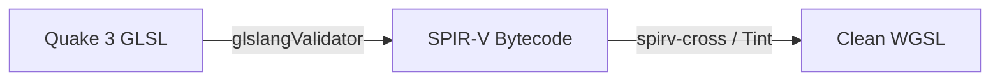

Because you are working in C/C++ natively on your static engine port, you do **not** want to write a regex text parser in JavaScript to translate these on the fly.

The industry standard for converting GLSL to WGSL programmatically is **`Naga`** (the shading language translator maintained by the WebGPU group/Mozilla for `wgpu`). It has a native C API and can compile directly into your project.

Alternatively, if you are working on your frontend asset pipeline, you can use Google's **`Tint`** or compilation toolchains. Here are the three best ways to translate your Quake 3 GLSL assets down into clean WGSL:

---

### Method 1: The Native Code Route (Embed `Naga` in your Port)

Since you are already linking your engine modules natively, you can include `naga` as a static library wrapper. It can take a raw string of GLSL (like the ones coming out of `tr_glsl.c`), parse it into an internal abstract syntax tree, and spit out perfectly clean, validated WGSL text.

The translation pipeline flows like this:

1. Feed your sanitized Quake 3 GLSL string into the **GLSL Frontend** parser.
2. Let Naga build its internal representation module.
3. Pass that module to the **WGSL Backend** writer to generate your runtime string.

### Method 2: The Command Line Toolchain (Ahead-of-Time Translation)

If you want to convert your `.glsl` file templates ahead of time during your engine's asset packaging build stage, you can install the `naga-cli` binary tool via cargo:

```bash
# Install the compiler CLI
cargo install naga-cli

# Convert a Quake 3 vertex shader straight to WebGPU WGSL
naga quad_vertex.vert quad_vertex.wgsl

```

### Method 3: The 2-Step Khronos Toolchain (Glslang + Tint)

If you hit an edge case where a complex desktop GLSL feature struggles with a direct conversion, the foolproof standard method used by browser engines like Chromium is to route it through an intermediate bytecode format:



1. **`glslangValidator`** compiles your GLSL down into a universal **SPIR-V** binary blob.
2. **`spirv-cross`** or Google’s **`Tint`** takes that SPIR-V binary and decompiles it back into fully compliant WGSL code.

---

### What to Look Out For in the Translation

When you look at the converted code, you'll instantly see why doing it manually is a headache. The syntax styles represent completely different design eras:

* **Type Layouts:** GLSL's familiar `vec4` or `mat4` become strictly defined layout structures in WGSL like `vec4<f32>` and `mat4x4<f32>`.
* **Variable Declarations:** Instead of placing modifiers like `uniform sampler2D u_texture` globally at the top of your file, WGSL adopts a Rust/TypeScript style layout using explicit attribute tags mapping to your engine's pipeline bind slots:

```rust
// What the converted WGSL looks like for a standard texture map
@group(0) @binding(0) var q3Sampler : sampler;
@group(0) @binding(1) var q3Texture : texture_2d<f32>;

@fragment
fn main(@location(0) uv : vec2<f32>) -> @location(0) vec4<f32> {
    return textureSample(q3Texture, q3Sampler, uv);
}

```

If you are using **`bgfx`**, its internal standalone compiler tool (**`shaderc`**) actually automates this entire abstraction layer for you under the hood using a subset of these exact translation mechanics!
